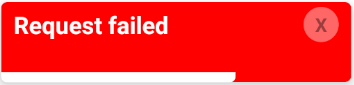

# react-native-warnings

## Description

Warning library for react native highly customizable.

## Install

```
$ yarn add react-native-warnings
```

## Demo




## Examples

```
import { StatusBar } from "expo-status-bar";
import React from "react";
import { StyleSheet, Text, View } from "react-native";
import { Warnings } from "react-native-warnings";

export default function App() {
  return (
    <View style={styles.container}>
      <StatusBar style="auto" />
      {/* <Warnings
        color="red"
        fontColor="white"
        message="Request failed"
        visible={true}
      /> */}
      <Warnings
        color="green"
        fontColor="white"
        message="Request success"
        visible={true}
      />
    </View>
  );
}

const styles = StyleSheet.create({
  container: {
    flex: 1,
    backgroundColor: "#fff",
    alignItems: "center",
    justifyContent: "center",
  },
});
```

## Documentation

```
Props                     Type                  Description                                                 Usage
----------------------------------------------------------------------------------------------------------------------
visible                   {boolean}             warnings visibility                                         (mandatory)
message                   {string}              warnings message                                            (mandatory)
color                     {string}              warnings backgorund color                                   (mandatory)
fontColor                 {string}              message color                                               (mandatory)

```
